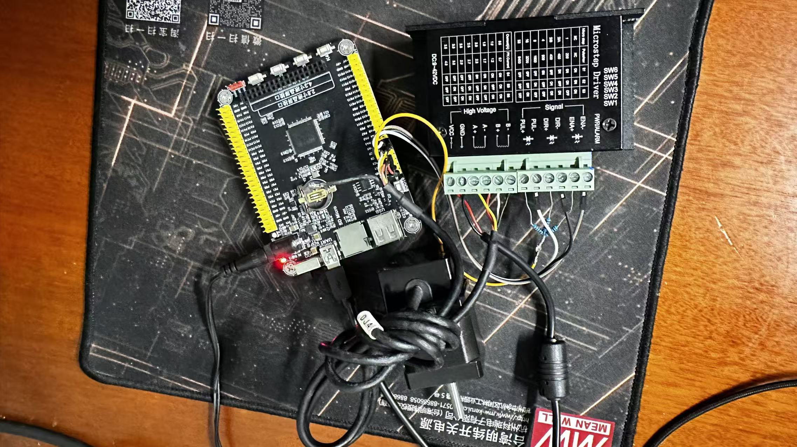

# 步进电机闭环控制工程

基于 RT-Thread + STM32H750，步进电机位置环控制。

## 硬件连接

| 信号 | MCU 引脚 | 说明 |
|------|---------|------|
| PUL (脉冲) | PA0 (AF1_TIM2) | TIM2 CH1 OC Toggle |
| DIR (方向) | PC1 | GPIO 输出, CW=HIGH / CCW=LOW |
| EN (使能) | PC3 | GPIO 输出, HIGH=使能 |
| ENC A | PC6 (AF2_TIM3) | 编码器 CH1 |
| ENC B | PC7 (AF2_TIM3) | 编码器 CH2 |
| 控制定时器 | TIM4 (timer4) | 20ms / 50Hz 控制周期 |



## 目录结构

```
project/
├── applications/
│   ├── stepper_drv/              # 公共驱动层
│   │   ├── stepper_motor_driver.c/h    # 电机驱动 (TIM OC Toggle, 无毛刺脉冲)
│   │   ├── stepper_encoder_driver.c/h  # 编码器驱动 (32 位累加)
│   │   └── stepper_pid_pos.c/h         # 位置式 PID (抗饱和)
│   ├── position_loop/            # 位置环控制器
│   │   ├── position_loop.c/h           # S 形加减速 + PID + 到位锁定
│   │   └── test_positionloop.c         # posloop 命令
│   ├── speed_loop/               # 速度环控制器
│   │   ├── speed_loop.c/h
│   │   └── test_speedloop.c
│   ├── open_loop/                # 开环控制器 (无编码器)
│   │   ├── stepper_openloop.c/h
│   │   └── test_openloop.c
│   └── main.c
├── board/
│   ├── Kconfig                   # 硬件配置菜单
│   └── CubeMX_Config/            # STM32CubeMX HAL 配置
├── rtconfig.h                    # RT-Thread 配置 (Kconfig 生成)
└── README.md
```

## 编译 & 烧录

```bash
menuconfig    # 配置硬件参数
scons -j4     # 编译
```

## MSH 命令

### 位置环

```bash
posloop <motor_id> <counts>          # 定位到目标位置 (编码器 counts)
posloop                              # 查看所有电机状态
posloop_tune <id> <kp> <ki> <kd>     # 在线调 PID
posloop_start <id>                   # 启动
posloop_stop <id>                    # 停止
```

### 速度环

```bash
speedloop <motor_id> <freq_hz>       # 定速运行 (正=CW, 负=CCW)
speedloop_tune <id> <kp> <ki> <kd>
```

### 开环

```bash
stepol <freq_hz>                     # 开环定速 (无编码器反馈)
stepol_dir cw|ccw                    # 设置方向
```

## 位置环控制原理

```
target(counts) → [S 形速度斜坡] → [PID + 前馈] → DIR + 脉冲频率
                       ↑                            ↓
                encoder ←─────────────────── 位置反馈 (32-bit counts)
```

### 加减速算法

采用 **Jerk-limited Trapezoidal**（加加速度限幅梯形），即加速度渐变、速度 S 形：

```
加速度:                        速度:
  ^                              ^
  |  ╱‾‾‾‾╲  jerk 限幅           |  ╭────╮
  | ╱      ╲                     | ╱      ╲
  |╱        ╲                    |╱        ╲
  +────────────>                  +────────────>
```

对比传统梯形：加速度从 0 渐变到最大值（而非跳变），加速度变化率由 `jerk` 控制。

### 三阶段控制

| 阶段 | 条件 | 策略 |
|------|------|------|
| 远距离 | `|err| > 20` | **PID + S 形前馈**（前馈占 90%，PID 微调 ≤ 10%） |
| 近距离 | `2 < |err| ≤ 20` | **比例减速** `freq = err × 27 Hz`，3 周期到位 |
| 到位 | `|err| ≤ 1` | **停机**，`HAL_TIM_OC_Stop` 真停止 |

### 到位防回弹

到位后锁存，只有新目标写入才解锁，避免编码器噪声触发反复微调。

## Kconfig 配置

```bash
menuconfig
# Hardware Drivers Config → On-chip Peripheral Drivers →
#   Enable Stepper Position-loop Control
```

| 参数 | 默认值 | 说明 |
|------|--------|------|
| SPEED_LIMIT | 80000 | 输出频率上限 (Hz) |
| RAMP_MAX_SPEED | 80000 | S 形斜坡巡航速度 (Hz) |
| MAX_ACCEL | 500 | 最大加速度 (Hz/周期) |
| S_CURVE_JERK | MAX_ACCEL/8 | 加加速度 (Hz/周期²)，越小越平滑 |
| MOVE_THRESHOLD | 20 | 到位死区 (counts) |
| CTRL_PERIOD_US | 20000 | 控制周期 (50 Hz) |
| KP / KI / KD | 5.0 / 0.5 / 0.1 | PID 增益 |

## 参数调优指南

**S 曲线平滑度**：减小 `S_CURVE_JERK`（如 MAX_ACCEL/12）→ 更平滑但加速慢；增大（如 MAX_ACCEL/4）→ 更快但冲击大。

**PID 修正占比**：`corr_limit = RAMP_MAX_SPEED × 0.10`，即 S 形前馈占 90%。如果跟踪滞后大，可适当增大 KP。

**到位精度**：`MOVE_THRESHOLD` 设太小会导致"爬行"迟迟不到位；设太大会提前退出。20 counts 是默认值。

## 许可

仅允许学习和非商业用途。禁止用于商业产品。
