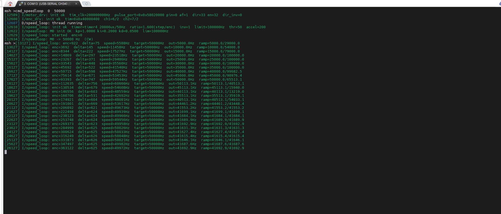
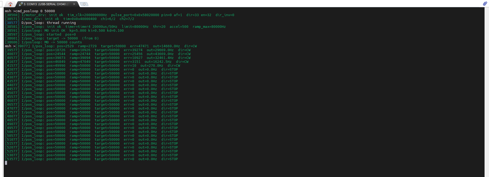

# 步进电机闭环控制工程

基于 RT-Thread + STM32H750，支持位置环 / 速度环 / 开环三种步进电机控制模式。

## 硬件连接

| 信号 | MCU 引脚 | 说明 |
|------|---------|------|
| PUL (脉冲) | PA0 (AF1_TIM2) | TIM2 CH1 OC Toggle |
| DIR (方向) | PC1 | GPIO 输出, CW=HIGH/CCW=LOW |
| EN (使能) | PC3 | GPIO 输出, HIGH=使能 |
| ENC A | PC6 (AF2_TIM3) | 编码器 CH1 |
| ENC B | PC7 (AF2_TIM3) | 编码器 CH2 |
| 控制定时器 | TIM4 (timer4) | 20ms/50Hz 控制周期 |


## 目录结构

```
project/
├── applications/
│   ├── stepper_drv/           # 公共驱动层
│   │   ├── stepper_motor_driver.c/h   # 步进电机驱动 (TIM OC Toggle)
│   │   ├── stepper_encoder_driver.c/h # 编码器驱动 (32位累加)
│   │   └── stepper_pid_pos.c/h        # 位置式 PID
│   ├── position_loop/         # 位置环控制器
│   │   ├── position_loop.c/h          # 核心算法 (斜坡+PID+回差定位)
│   │   └── test_positionloop.c        # posloop 命令
│   ├── speed_loop/            # 速度环控制器
│   │   ├── speed_loop.c/h
│   │   └── test_speedloop.c
│   ├── open_loop/             # 开环控制器 (无编码器)
│   │   ├── stepper_openloop.c/h
│   │   └── test_openloop.c
│   └── main.c
├── board/
│   ├── Kconfig                # 硬件配置菜单
│   ├── CubeMX_Config/         # STM32CubeMX 生成的 HAL 配置
│   └── linker_scripts/        # 链接脚本
├── rtconfig.h                 # RT-Thread 配置 (Kconfig 生成)
├── .config                    # Kconfig 配置文件
└── README.md
```

## 编译 & 烧录

```bash
# 生成 RT-Thread 配置
menuconfig

# 编译 (Keil MDK)
# 打开 project.uvprojx → Build

# 或使用 scons
scons -j4
```

## MSH 命令

### 位置环 (推荐)

```bash
posloop <motor_id> <counts>    # 定位到目标编码器位置
posloop                         # 查看所有电机状态
posloop_tune <id> <kp> <ki> <kd>  # 在线调参
posloop_start <id>              # 启动
posloop_stop <id>              # 停止
```

### 速度环

```bash
speedloop <motor_id> <freq_hz> # 定速运行 (正=CW, 负=CCW)
speedloop_tune <id> <kp> <ki> <kd>
```



### 开环

```bash
stepol <freq_hz>               # 开环定速 (无编码器反馈)
stepol_dir cw|ccw              # 设置方向
```

## 位置环控制原理

```
target(counts) → [梯形速度斜坡] → [PID/回差定位] → DIR + 脉冲频率
                      ↑                              ↓
               encoder ←──────────────────── 位置反馈 (32-bit counts)
```

三阶段控制：
1. **远 (>20 counts)**: PID + 梯形速度前馈，高速接近
2. **近 (2~20 counts)**: 关闭 PID，比例频率 `err×27 Hz`，3 周期内到位
3. **到位 (±1 counts)**: 停转，`HAL_TIM_OC_Stop` 真停机



## Kconfig 配置

```bash
menuconfig
# 路径: Hardware Drivers Config → On-chip Peripheral Drivers →
#       Enable Stepper Position-loop Control / Speed-loop Control
```

关键参数：

| 参数 | 默认值 | 说明 |
|------|--------|------|
| SPEED_LIMIT | 100000 | 速度上限 (Hz) |
| RAMP_MAX_SPEED | 100000 | 斜坡最大速度 (Hz) |
| MAX_ACCEL | 500 | 加速度 (Hz/周期) |
| MOVE_THRESHOLD | 20 | 到位死区 (counts) |
| CTRL_PERIOD_US | 20000 | 控制周期 50Hz |
| KP | 0.5 | 比例增益 (位置环) |
| KI | 0.05 | 积分增益 |
| KD | 0.05 | 微分增益 |


仅允许学习和非商业用途。禁止用于商业产品。